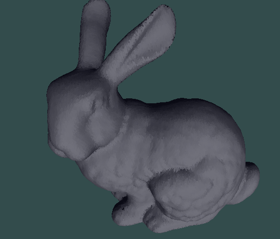

# Student Information

student name: 박준영, Junyoung Park

student id: 20181009

-Operation

front buffer model color before picking : Lighting

front buffer model color after picking : red

-Read pixels

Back buffer model color (Object ID) : Light gray (glColor3f(0.4, 0.5, 0.6))

As we already reminded, only read a pixel to back buffer which is not displayed.

# Result images

