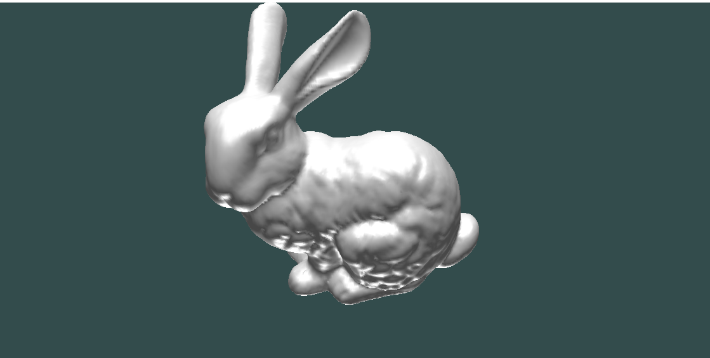
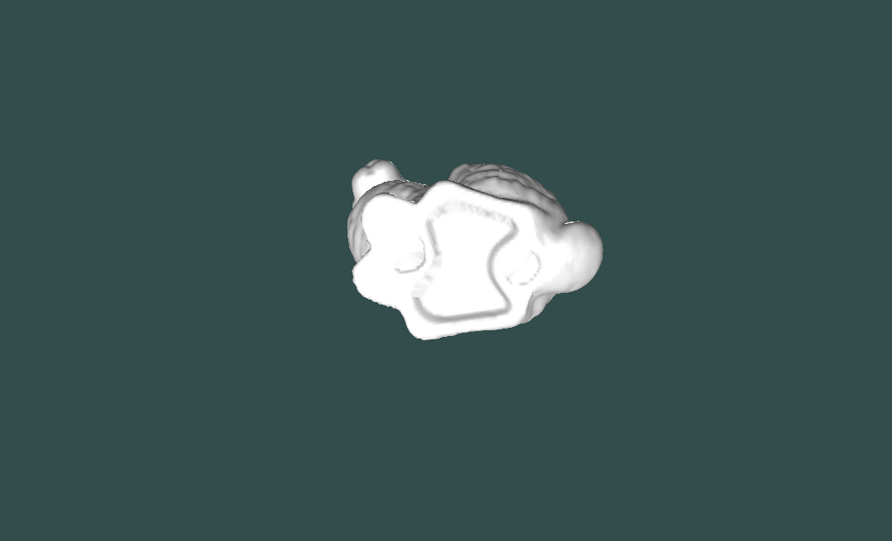
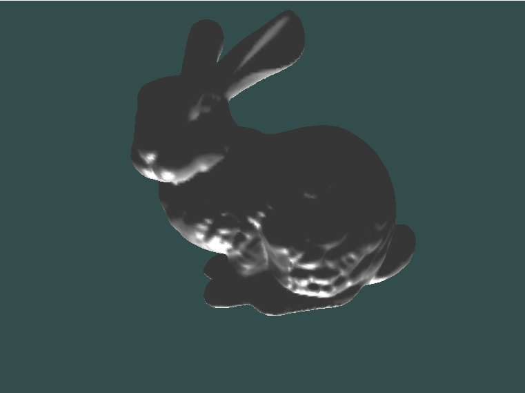
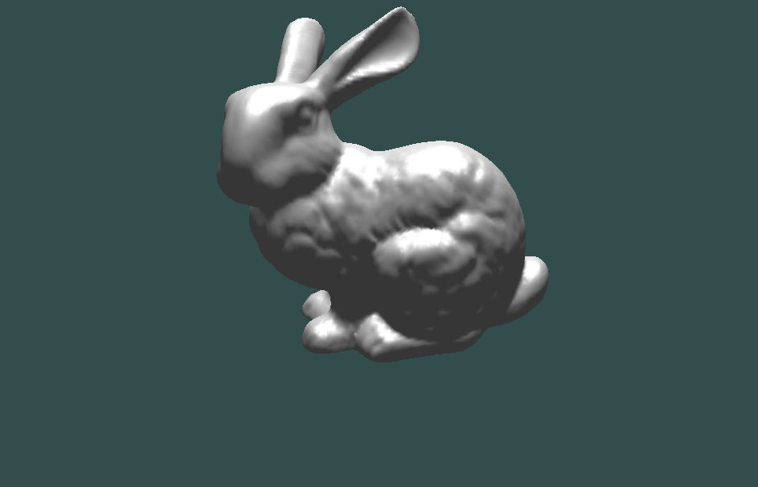
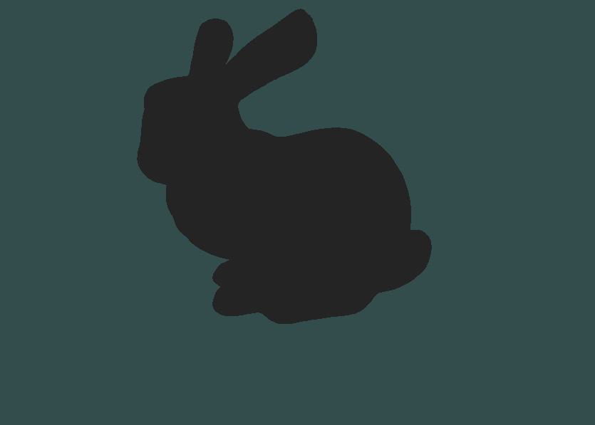
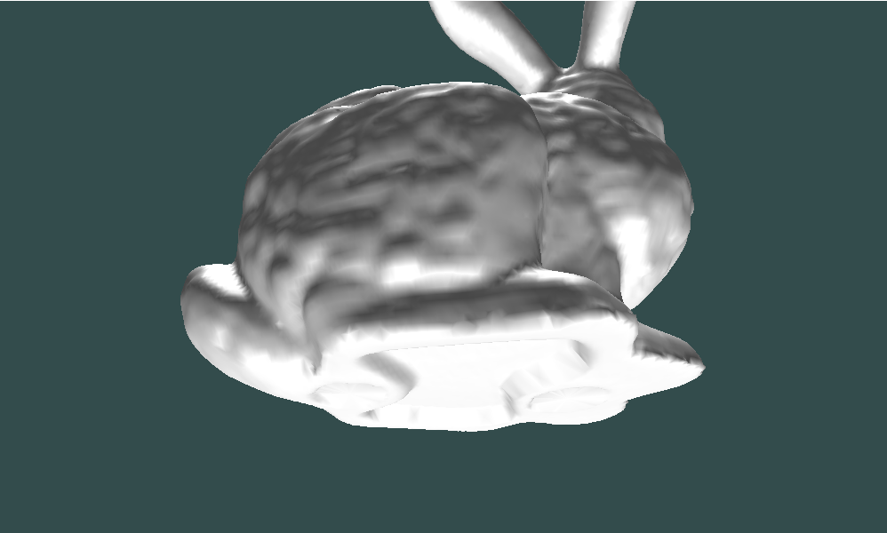
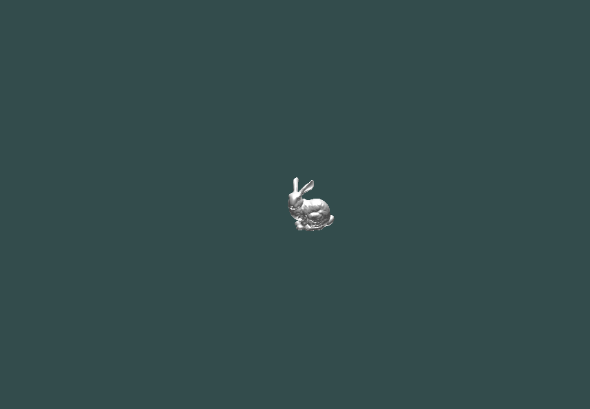
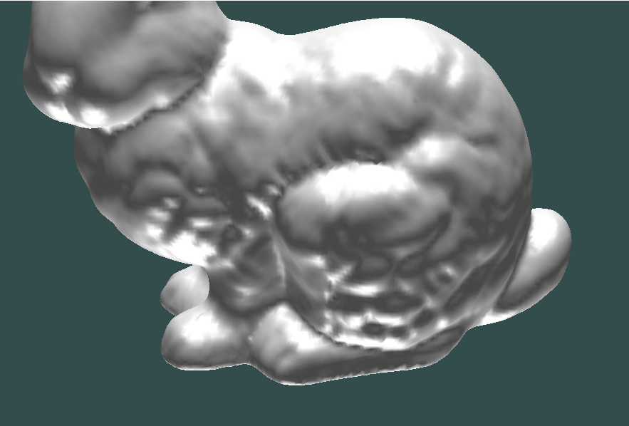
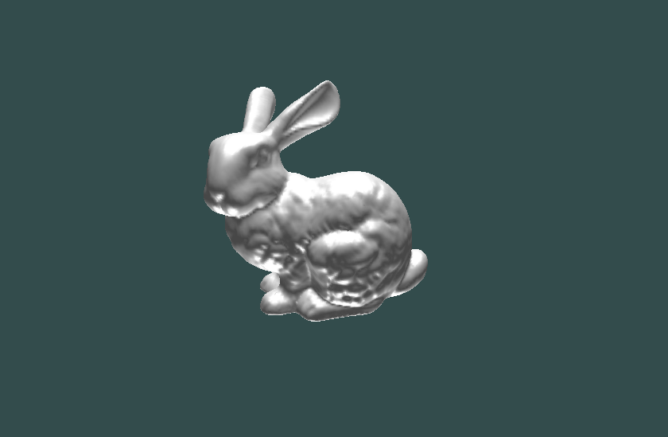

# Implementations

##Trakball camera
Rotate the camera by dragging
Dolly in and dolly out by scrolling (i.e., mouse wheeling)
Zoom in and Zoom out

The camera which is orbiting around virtual sphere.

##Lighting
Apply phong shading model (ambient/diffuese/specular) and Gouraud Shading option

-Operation

Point and directional light ( turn on and off -> 1/2  & 3/4  press the keyboard buttons)

zoom in / out and dolly in / out ( zoom in / out -> w / q  & dolly in / out -> mouse wheeling )

trackball camera (by using mouse dragging)

# Result images

