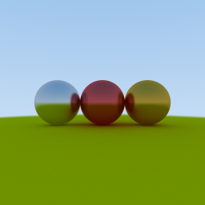

# Implementations

## 1. Materials

### This section covers the implementation of the following meterials.
- Lambertian
- Metal
- Dielectric
- Area light
#### Lambertian
The Lambertian materials are designed to reflect all incoming light to a point on a uniform hemisphere surface. Therefore, it can be implemented by randomly reflecting to hemi sphere by using a scattering function on the incoming light.
here is implement result.

#### Metal

In case of metal, that is reflect incoming light to outgoing light by using a specular reflection. So, I implemented the following equation in my scattering function.

> GIST, 2019 Computer Graphics - spring - Illumination lecture note

Here is implement result.

#### Dielectric

After that, In case of dielectric, the main objective is to implement the phenomenon in which the ray is refracted at the hit point. To take into account the characteristics of this objects, I used the index of refraction given in the project and used the refraction angle by using snell's law and the Schlick aproximation as well.

Here are definitions.

Then, I apply this concept to my dielectric scattering function, I successfully render this image below.

By placing the three materials so far in the scene, I can get the following figure below. However, it has not yet implemented a diffuse sphere(area light).

#### Area light

The last section, I implemented the sphere of light. Since direct sampling is not included yet, fortunately, when the prior bounce hit the area light, then scattered ray is hit to the another materials, the color of the material's sphere is painted area light color during the next shading process.

## 2. Anti-aliasing

This technique is noise reduction that caused by lack of number of ray samples in each pixels. So, I shoot multiple rays by giving randomness inside a current camera pixel. here is implementation code below.

### original code at the (u,v)

~~~
float u = float(index.x) / float(canvas.height());
float v = float(index.y) / float(canvas.height());
~~~

### apply to anti-aliasing code at the (u,v)

~~~
float u = (float(index.x) + glm::linearRand(0.0f, 1.0f)) / float(canvas.width());
float v = (float(index.y) + glm::linearRand(0.0f, 1.0f)) / float(canvas.height());
~~~

Then, average all samples of one pixel. The figure below shows the rendering results using 16 spp(left) and 128 spp(right).

## 3. Indirect lighting

The main purpose of this section is to implement integrator by considering multiple bounce. This technique is used to shading the color that is hit and scattered by repeating it back to a pre-defined depth. The figure below shows the rendering results using 1 depth(left) and 15 depth(right). After that, I sucessfully can check that color bleeding effects, soft shadows, and so on.

## 4. Direct light sampling

In this section, I have prepared several experimental cases to see whether direct lighting is working properly or not. 
If the radius of the light sphere has a very small value, the rendering result should be a very dark one. Because there is a significant decrease in the probability that light rays hit into the diffused sphere.

In this situation, if direct lighting is given, all visible points should be shaded. So, I need to check for visability to do that.

~~~
Direct_light.o = hit.p + eps;

//testscene1 , because of the fixed area light poisition both scenes
Direct_light.dir = glm::vec3(0, 1, -1) + hemi_sample_point - hit.p; 

//testscene2 , because of the fixed area light poisition both scenes
Direct_light.dir = glm::vec3(-1.5f, 1.5, 0) + hemi_sample_point - hit.p;

Direct_light.t = std::numeric_limits<float>::max();

//visability check and if so, try direct light shading.
if (scene->rayIntersect(Direct_light, shadow_hit)) {
  MaterialPointer material2 = shadow_hit.material;
  if (material2->emitted() !=
      glm::vec3{0, 0, 0}) // if the hit object is diffuse light, then apply
                              // direct light to the pixel L.
    return material->emitted() +
           albedo * scene->sampleDirectLight(Direct_light, shadow_hit) * weight +
           albedo * integrate(r_out, scene, depth + 1);
}
~~~

### Test scene 1.

Here is a rendering results which applies to direct lighting(left) or not applies to direct lighting(right)

</img>
</img>

### Test scene 2.

This is the result of performing the same procedure in test scene1. the results which applies to direct lighting(left) or not applies to direct lighting(right)

</img>
</img>

## 5. Defocus blur

In this section, blur effect was implemented according to the focal length of the camera. I followed given tutorial and lecture note below. 

</img>

</img>

> https://steveharveynz.wordpress.com/2012/12/21/ray-tracer-part-5-depth-of-field/

Actually I need many required parameters on this section. But, in this programming assignment4, the skeleton code were almost implemented, so I add a few codes as follows myself.

~~~
glm::vec3 view_plane_point = bottomLeft + s * horizontal + t * vertical; //define a view plane
glm::vec3 rand_xy = parameters.lensRadius * rand_x_y(); // make a randomness for the points
glm::vec3 delta = u * rand_xy.x + v * rand_xy.y; // apply to randomness at u,v positions
ne::Ray(origin + delta, view_plane_point - origin - delta); //generates a new ray at the view plane points
~~~

Same as above section, I prepared an experiment on two scene here. I rendered how the blur effect would be achieved by changing the value of the focal length. Both of cases, left figure has 1.0f focal length and right figure has 4.0f focal length.

### Test scene 1.

</img>
</img>

### Test scene 2.

</img>
</img>
